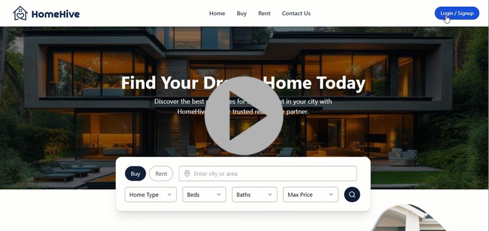

# Real Estate Property Management System

A minimal full-stack web platform inspired by Zillow, featuring property listing capabilities and basic admin functionalities.

---
## 📽️ Demo Video

<a href="https://drive.google.com/file/d/1P5OxIDxH7pXa-mtfw90DpeUwJ9jbUoCS/view?usp=sharing" target="_blank">
  
</a>

## Technologies Used

- **Frontend:** React, Tailwind CSS, JavaScript  
- **Backend:** Node.js, Express.js  
- **Database:** MongoDB  
- **Authentication:** JWT (JSON Web Tokens)  
- **Image Upload:** Cloudinary  

---

## Project Overview

This project is a mini Zillow-inspired platform that allows users to browse, filter, and view properties, while admins can manage listings through a dedicated dashboard.

---

## Features

### Public User

- **Home Page:**  
  - Top navigation bar with links  
  - Hero section containing property filters  
  - "Who We Are" section  
  - Recent properties displayed (limited to three)  
- **Property Browsing:**  
  - Filter properties without login  
  - View property listings with filters and a map view showing property locations and prices  
  - Click property cards to view detailed pages showing images, details, agent contact info, and location on the map  
- **Authentication:**  
  - Users can sign up or log in via the navigation bar  
  - Role-based redirection after login: Admin users are directed to the admin dashboard  

### Admin User

- **Admin Dashboard:**  
  - Summary statistics (total properties, total rents, total buys, breakdown by property type)  
  - List of recent properties  
- **Add New Property:**  
  - Upload multiple images (stored on Cloudinary)  
  - Fill in property details and save  
- **Manage Properties:**  
  - View all properties with filtering and map integration  
  - Edit, delete, or view individual properties  
- **Sidebar Navigation:**  
  - Easy access to dashboard, add property, and manage property pages  

---

## Future Improvements
 
- Add property bookmarking/favorites feature for users  
- Add property ratings and reviews  
- Implement email notifications for inquiries or updates  
- Improve form validation with user-friendly error messages  
- Add server-side pagination for property listings    
- Enhance UI/UX with animations and responsive design improvements  
- Add search autocomplete and advanced filters (price range, neighborhood, etc.)  

---

## Setup & Installation

1. Clone the repository:  
   ```bash
   git clone https://github.com/HasyaHansanganie/Real-Estate-Property-Management-System.git
   ```
2. Install backend dependencies:
   ```bash
   cd backend
   npm install
   ```
3. Install frontend dependencies:
   ```bash
   cd ../frontend
   npm install
   ```
4. Create a .env file in the backend directory with your MongoDB URI, JWT secret, and Cloudinary credentials. Example:
   ```bash
   MONGO_URI=your_mongodb_uri
   JWT_SECRET=your_jwt_secret
   CLOUDINARY_CLOUD_NAME=your_cloud_name
   CLOUDINARY_API_KEY=your_api_key
   CLOUDINARY_API_SECRET=your_api_secret
   ```
   
5. Run the backend server:
   ```bash
   cd ../backend
   npm start
   ```

6. Run the frontend development server:
   ```bash
   cd ../frontend
   npm start
   ```

7. Open your browser and navigate to http://localhost:3000 to access the app.
